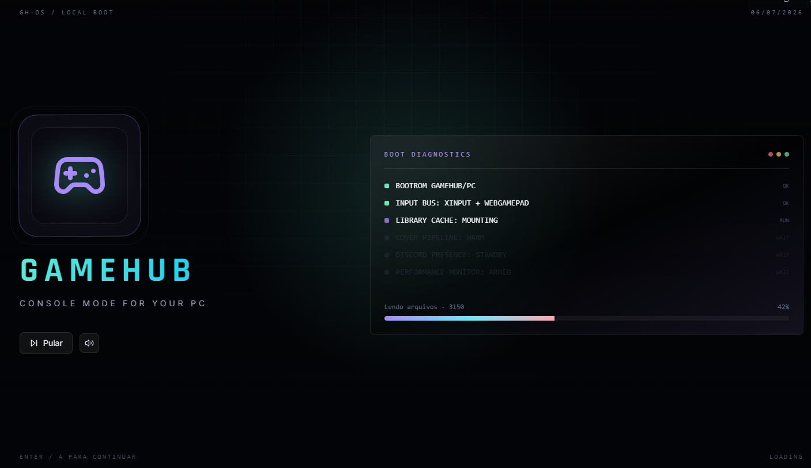
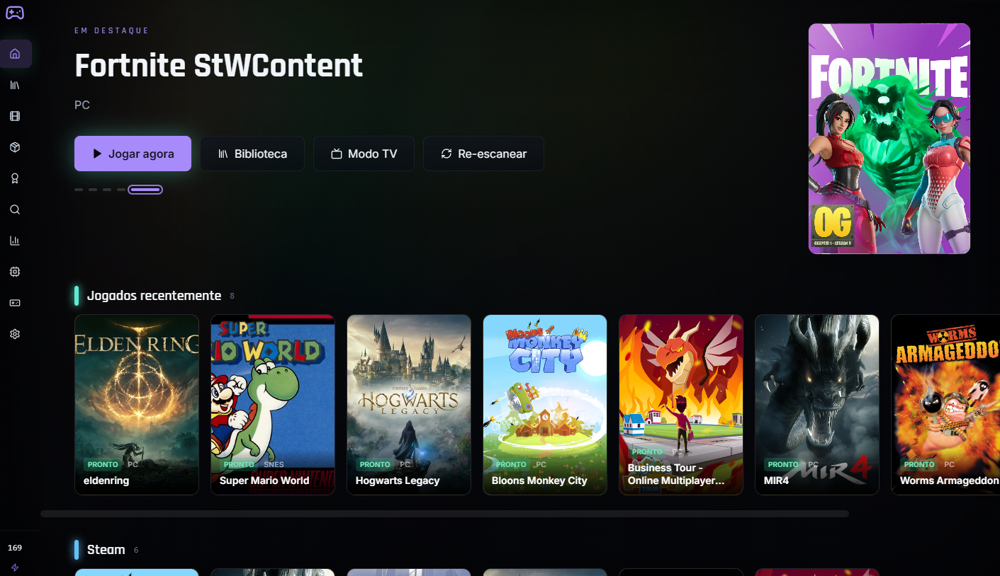
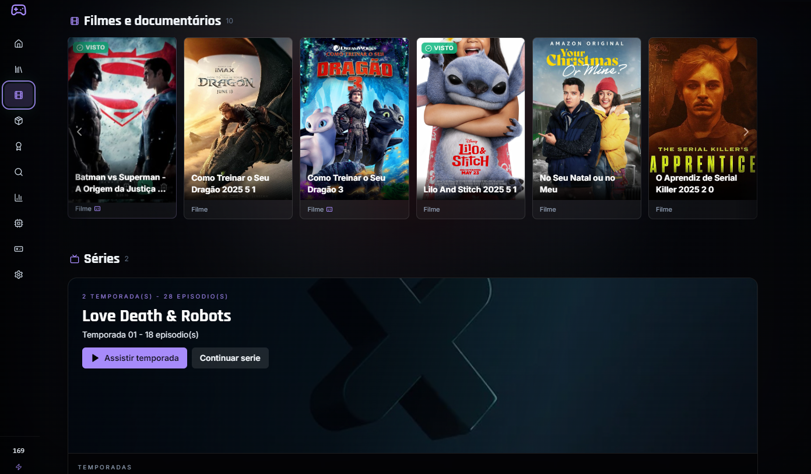

# GameHub 0.3.0 🎮

> Console-style launcher for PC + emulators + cinema mode, with tracking of playtime, journey (played/completed/platinum), save snapshots, visual library, and live performance metrics (CPU, GPU, RAM, FPS via PresentMon — works even on EAC/BattlEye games).

## Portfolio Preview

GameHub is a Windows desktop app built with Electron, React, TypeScript, and Tailwind. It is designed as a personal console-style command center for PC games, emulator libraries, save snapshots, cinema mode, and session telemetry.

| Library | Game detail | Cinema mode |
|---|---|---|
|  |  |  |

**Validation snapshot**

- `npm ci` reproducible install
- `npm run typecheck` TypeScript checks
- `npm run build` production build
- `npm test -- --run` Vitest suite
- `npm audit fix` applied; remaining audit item is the React Router v6 -> v7 major migration

## ⚡ Why GameHub auto-elevates to administrator

GameHub asks Windows for elevation at startup. This is **required**, not optional:

- **FPS reading on EAC/BattlEye protected games** (Elden Ring, Helldivers 2, etc.) uses Intel PresentMon's ETW (Event Tracing for Windows) capture. ETW sessions can only be created by elevated processes — there is no Windows API to capture present timing from medium-IL.
- **RTSS shared memory** (when not blocked by anti-cheat) is published with a security descriptor that grants read to medium-IL, but RTSS itself requires admin to inject its overlay, so without an elevated GameHub we can never confirm RTSS is healthy.
- **Process telemetry** for some hardened processes (anti-cheat, NVIDIA Frame Capture, MSI Afterburner) is hidden from non-admin token holders. CPU/RAM read paths fall back to the same elevated proc-helper.

The startup elevation is **one UAC prompt per launch**, not per game. From the prompt onward every PC, Windows, Steam, or Epic title you open in that session reads FPS automatically through PresentMon.

To bypass auto-elevation during hot-reload development:

```bash
npm run dev:no-auto-admin
```

This sets `GAMEHUB_NO_AUTO_ADMIN=1` and skips the elevation gate — FPS won't read on anti-cheat games, but the regular UI works for iteration.

## Quick Download ⬇️

- Windows Installer (`.exe`): [Download GameHub Setup](https://github.com/recalchi/gamehub/releases/latest/download/GameHub-Setup-x64.exe)
- Portable (`.zip`): [Download GameHub Portable](https://github.com/recalchi/gamehub/releases/latest/download/GameHub-portable-x64.zip)
- Checksums:
  - [Setup SHA256](https://github.com/recalchi/gamehub/releases/latest/download/GameHub-Setup-x64.exe.sha256)
  - [Portable SHA256](https://github.com/recalchi/gamehub/releases/latest/download/GameHub-portable-x64.zip.sha256)
- Latest release page: [Releases](https://github.com/recalchi/gamehub/releases/latest)

### Fast Route / Rota rapida 🧩

**For a friend/player:** open [Latest Release](https://github.com/recalchi/gamehub/releases/latest), download `GameHub-Setup-x64.exe`, install, accept the Windows UAC prompt, then add game/movie folders in Settings.

**For a maintainer/dev:** clone the repo, run `npm ci`, validate with `npm run typecheck` and `npm run build`, then generate Windows packages with `npm run dist:win:full`.

Release assets generated by the current pipeline:

- `GameHub-Setup-x64.exe`
- `GameHub-Setup-x64.exe.blockmap`
- `GameHub-portable-x64.zip`
- `GameHub-portable-x64-<version>.zip`
- `latest.yml`
- `releases.json`
- `*.sha256`

---

## Language / Idioma 🌍

- [PT-BR](#pt-br)
- [EN](#en)

Use toggle mode:
- PT-BR: open the section below
- EN: open the English section below

---

<a id="pt-br"></a>

<details open>
<summary><strong>PT-BR</strong></summary>

## PT-BR 🇧🇷

### Navegacao rapida 🧭

- [Visao geral](#pt-visao-geral)
- [Principais recursos](#pt-principais-recursos)
- [Instalacao](#pt-instalacao)
- [Rota para amigos/testadores](#pt-rota-para-amigostestadores)
- [Build local](#pt-build-local)
- [Publicacao de versao](#pt-publicacao-de-versao)
- [Estado de validacao](#pt-estado-de-validacao)
- [Roadmap (proximas melhorias)](#pt-roadmap-proximas-melhorias)

<a id="pt-visao-geral"></a>

### Visao geral ✨

GameHub e um hub para jogos e emuladores no Windows, com interface inspirada em consoles, foco em biblioteca visual, scans de jogos, covers, gerenciamento de saves e monitoramento de sessao.

<a id="pt-principais-recursos"></a>

### Principais recursos 🚀

- Biblioteca de jogos por plataforma (PC + emuladores)
- Tela inicial estilo console com navegacao por controle
- Integracoes (Steam/Epic/Discord Rich Presence)
- Painel de desempenho por jogo
- Sistema de jornada:
  - status `jogado`, `zerado`, `platinado`
  - persistencia independente da instalacao do jogo
  - registro visual com capa + link de re-download
- Save manager com snapshots
- Modo cinema (catalogo local, watched tracking e subtitulos)
- Download manager com:
  - progresso em tempo real
  - **resume de parcial via HTTP Range**
  - **checksum SHA-256 opcional**
- Sidebar com indicador confiavel de `Now Playing`

<a id="pt-instalacao"></a>

### Instalacao 🛠️

1. Baixe o instalador em [GameHub Setup](https://github.com/recalchi/gamehub/releases/latest/download/GameHub-Setup-x64.exe)
2. Execute e siga o wizard
3. Abra o GameHub — o Windows vai pedir **UAC (Controle de Conta de Usuario)** uma vez por sessao. Aceite. Isso e obrigatorio para ler FPS de jogos com anti-cheat (Elden Ring etc.) via PresentMon/ETW. Veja "Por que o GameHub pede admin" no topo do README.
4. Configure suas pastas em `Configuracoes > Biblioteca`

Opcional portatil:

1. Baixe [GameHub Portable](https://github.com/recalchi/gamehub/releases/latest/download/GameHub-portable-x64.zip)
2. Extraia o `.zip`
3. Execute `GameHub.exe`

Se o link direto der 404, abra a pagina [Latest Release](https://github.com/recalchi/gamehub/releases/latest) e baixe pelo bloco **Assets**. Os nomes esperados sao `GameHub-Setup-x64.exe` e `GameHub-portable-x64.zip`.

<a id="pt-rota-para-amigostestadores"></a>

### Rota para amigos/testadores 🧑‍🚀

1. Acesse [github.com/recalchi/gamehub/releases/latest](https://github.com/recalchi/gamehub/releases/latest)
2. Baixe `GameHub-Setup-x64.exe`
3. Instale e aceite o UAC do Windows na abertura
4. Entre em `Configuracoes > Biblioteca` e adicione as pastas de jogos/filmes
5. Use `Re-escanear` para carregar capas, tamanho, plataforma e jogos de PC/emuladores

Para teste sem instalador, baixe `GameHub-portable-x64.zip`, extraia em uma pasta curta como `D:\GameHub`, e execute `GameHub.exe`.

<a id="pt-build-local"></a>

### Build local 🧪

```bash
npm ci
npm run typecheck
npm run build

# Dev com auto-elevacao (recomendado — FPS funciona):
npm run dev

# Dev sem auto-elevacao (para iterar mais rapido em UI / sem UAC repetido):
npm run dev:no-auto-admin
```

Pacotes Windows:

```bash
npm run dist:win
npm run dist:win:portable
npm run manifest:win
```

Build completo para gerar instalador + portatil + manifesto:

```bash
npm run dist:win:full
```

Arquivos gerados em `release/`:

- `GameHub-Setup-x64.exe`
- `GameHub-portable-x64.zip`
- `latest.yml`
- `releases.json`
- checksums `.sha256`

<a id="pt-publicacao-de-versao"></a>

### Publicacao de versao 🚢

O branch principal e `main`. Para publicar uma build:

```bash
git checkout main
git pull --ff-only origin main
npm ci
npm run typecheck
npm run build
git tag v<versao-do-package-json>
git push origin main --tags
```

O workflow `.github/workflows/release-win.yml` tambem pode ser iniciado manualmente pelo GitHub Actions. Ele publica os assets com nomes estaveis usados nos links acima.

<a id="pt-estado-de-validacao"></a>

### Estado de validacao ✅

Validado nesta versao:

- `npm run typecheck` OK
- `npm run build` OK
- `npm test -- --run` OK
- `npm audit fix` aplicado; pendencia restante: migracao major `react-router-dom` v6 -> v7

<a id="pt-roadmap-proximas-melhorias"></a>

### Roadmap (proximas melhorias) 🗺️

1. Conta de usuario + sync opcional (saves, jornada, conquistas)
2. Metadata fallback providers:
   - TheGamesDB
   - ScreenScraper
3. Wizard unificado de download/instalacao de emuladores
4. Mapeamento de controle por emulador (gravar INI/YAML por backend)
5. Catalogo "leve" mais rico (links, tamanho, capa, status de disponibilidade)
6. SQLite opcional para bibliotecas muito grandes (+5k entradas)
7. Melhorias de UX:
   - filtros discretos avancados
   - organizacao de cards por qualidade de metadata
8. Telemetria local opt-in para diagnostico de launch failures
9. Migrar `react-router-dom` v6 -> v7 para encerrar as pendencias moderadas restantes do `npm audit`

---

</details>

<a id="en"></a>

<details>
<summary><strong>EN</strong></summary>

## EN 🇺🇸

### Quick Navigation 🧭

- [Overview](#en-overview)
- [Key Features](#en-key-features)
- [Install](#en-install)
- [Friend/tester route](#en-friendtester-route)
- [Local Build](#en-local-build)
- [Publishing a release](#en-publishing-a-release)
- [Validation Status](#en-validation-status)
- [Roadmap (next updates)](#en-roadmap-next-updates)

<a id="en-overview"></a>

### Overview ✨

GameHub is a Windows launcher hub for PC + emulators with a console-like UX, visual library focus, game scanning, cover management, save snapshots, and runtime monitoring.

<a id="en-key-features"></a>

### Key Features 🚀

- Library by platform (PC + emulators)
- Console-style home UI with controller navigation
- Integrations (Steam/Epic/Discord Rich Presence)
- Per-game performance panel
- Journey tracking:
  - `played`, `completed`, `platinum`
  - persisted independently from installed binaries
  - visual record with cover + re-download link
- Save manager with snapshots
- Cinema mode (local catalog, watched tracking, subtitles)
- Download manager with:
  - real-time progress
  - **resume via HTTP Range**
  - **optional SHA-256 checksum validation**
- Reliable sidebar `Now Playing` indicator

<a id="en-install"></a>

### Install 🛠️

1. Download [GameHub Setup](https://github.com/recalchi/gamehub/releases/latest/download/GameHub-Setup-x64.exe)
2. Run installer
3. Configure folders in `Settings > Library`

Portable mode:

1. Download [GameHub Portable](https://github.com/recalchi/gamehub/releases/latest/download/GameHub-portable-x64.zip)
2. Extract
3. Run `GameHub.exe`

If the direct link returns 404, open [Latest Release](https://github.com/recalchi/gamehub/releases/latest) and download from **Assets**. Expected names are `GameHub-Setup-x64.exe` and `GameHub-portable-x64.zip`.

<a id="en-friendtester-route"></a>

### Friend/tester route 🧑‍🚀

1. Open [github.com/recalchi/gamehub/releases/latest](https://github.com/recalchi/gamehub/releases/latest)
2. Download `GameHub-Setup-x64.exe`
3. Install and accept the Windows UAC prompt at startup
4. Open `Settings > Library` and add game/movie folders
5. Use `Rescan` to load covers, size, platform, and PC/emulator entries

For a no-installer test, download `GameHub-portable-x64.zip`, extract it to a short path such as `D:\GameHub`, and run `GameHub.exe`.

<a id="en-local-build"></a>

### Local Build 🧪

```bash
npm ci
npm run typecheck
npm run build
```

Windows packages:

```bash
npm run dist:win
npm run dist:win:portable
npm run manifest:win
```

Full Windows release package:

```bash
npm run dist:win:full
```

Generated files in `release/`:

- `GameHub-Setup-x64.exe`
- `GameHub-portable-x64.zip`
- `latest.yml`
- `releases.json`
- `.sha256` checksums

<a id="en-publishing-a-release"></a>

### Publishing a release 🚢

The main branch is `main`. To publish a build:

```bash
git checkout main
git pull --ff-only origin main
npm ci
npm run typecheck
npm run build
git tag v<package-json-version>
git push origin main --tags
```

The `.github/workflows/release-win.yml` workflow can also be started manually from GitHub Actions. It publishes stable asset names used by the download links above.

<a id="en-validation-status"></a>

### Validation Status ✅

Validated for this version:

- `npm run typecheck` OK
- `npm run build` OK
- `npm test -- --run` OK
- `npm audit fix` applied; remaining item: `react-router-dom` v6 -> v7 major migration

<a id="en-roadmap-next-updates"></a>

### Roadmap (next updates) 🗺️

1. Optional account + cloud sync (saves, journey, achievements)
2. Metadata fallback providers:
   - TheGamesDB
   - ScreenScraper
3. Unified in-app emulator download/install wizard
4. Per-emulator controller mapping (write INI/YAML per backend)
5. Expanded lightweight catalog (links, size, cover, availability)
6. Optional SQLite migration for very large libraries (5k+ entries)
7. UX polishing:
   - advanced discreet filters
   - metadata quality organization
8. Opt-in local telemetry for launch failure diagnostics
9. Migrate `react-router-dom` v6 -> v7 to close the remaining moderate `npm audit` items

---

</details>

## Maintainers 🤝

- Repository: [recalchi/gamehub](https://github.com/recalchi/gamehub)
- Issues: [Open an issue](https://github.com/recalchi/gamehub/issues/new/choose)
